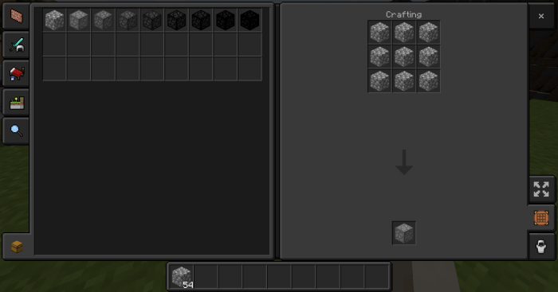
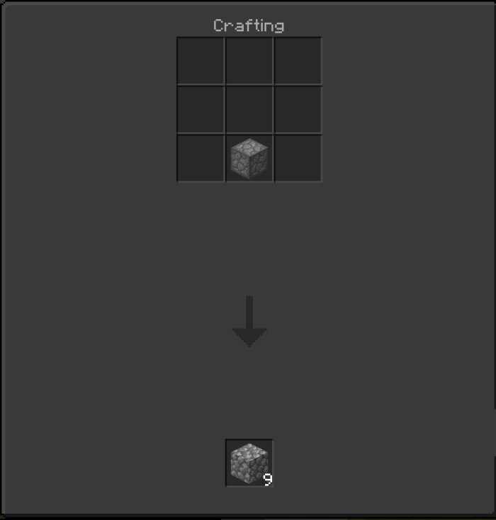

 <div align="center" style="display: block; margin-left: auto; margin-right: auto;">
  
  <a href="https://github.com/NewCaledoniaDevTeam/CompressedCobblestone/graphs/contributors">
    
  </a>
  <a href="https://github.com/NewCaledoniaDevTeam/CompressedCobblestone/network/members">
    
  </a>
  <a href="https://github.com/NewCaledoniaDevTeam/CompressedCobblestone/stargazers">
    
  </a>
  <a href="https://github.com/NewCaledoniaDevTeam/CompressedCobblestone/issues">
    
  </a>
  <a href="https://github.com/NewCaledoniaDevTeam/FabricJavaMod/blob/master/LICENSE">
    
  </a>

</div>

<!-- PROJECT LOGO -->
<br/>
<p align="center">
  <a href="https://github.com/NewCaledoniaDevTeam/CompressedCobblestone">
    
  </a>

  <h3 align="center">Compressed Cobblestone</h3>

  <p align="center">
    Cobblestone but compressed
    <br/>
    <a href="https://newcaledoniadevteam.github.io/CompressedCobblestone/"><strong>Explore the docs »</strong></a>
    <br/>
    <br/>
    <a href="https://github.com/NewCaledoniaDevTeam/CompressedCobblestone">View Code</a>
    ·
    <a href="https://github.com/NewCaledoniaDevTeam/CompressedCobblestone/issues">Report Bug</a>
    ·
    <a href="https://github.com/NewCaledoniaDevTeam/CompressedCobblestone/issues">Request Feature</a>
  </p>
</p>


<!-- TABLE OF CONTENTS -->
<details open="open">
  <summary>Table of Contents</summary>
  <ol>
    <li>
      <a href="#about-the-project">About The Project</a>
    </li>
    <li>
      <a href="#getting-started">Getting Started</a>
      <ul>
        <li><a href="#installation">Installation</a></li>
      </ul>
    </li>
    <li><a href="#roadmap">Roadmap</a></li>
    <li><a href="#contributing">Contributing</a></li>
    <li><a href="#license">License</a></li>
    <li><a href="#contact">Contact</a></li>
    <li><a href="#acknowledgements">Acknowledgements</a></li>
  </ol>
</details>


<!-- ABOUT THE PROJECT -->
## About The Project

With this addon, anyone will be able to compress of cobblestone into the 8 new blocks that allow for an easier form to carry.

This was inspired by the original mod in Minecraft: Java Edition called [Extra Utilities](https://ftbwiki.org/Extra_Utilities).

The next ‘tier’ of each Compressed Cobblestone is nine of the lower ‘tier’ in a crafting grid.

These are the name of the compressed cobblestone:
- Compressed Cobblestone (9 Cobblestone)
- Double Compressed Cobblestone (81 Cobblestone)
- Triple Compressed Cobblestone (729 Cobblestone)
- Quadruple Compressed Cobblestone (6,561 Cobblestone)
- Quintuple Compressed Cobblestone (59,049 Cobblestone)
- Sextuple Compressed Cobblestone (531,441 Cobblestone)
- Septuple Compressed Cobblestone (4,782,969 Cobblestone)
- Octuple Compressed Cobblestone (43,046,721 Cobblestone)

To craft these new blocks, you just fill up the whole crafting table



To uncraft these new blocks, you just place one anywhere on the crafting table and it goes the next lower ‘tier’



You can also use a command to bypass creating all these by hand. (# equals any number)

   ```txt
   /give @s cc:cc_#
   ```

For more information visit the [wiki](https://ftbwiki.org/Compressed_Cobblestone_(Extra_Utilities)) or check it out the [GitHub](https://github.com/PiSaucer/MiniExtraUtilities).


<!-- GETTING STARTED -->
## Getting Started

To get a local copy up and running follow these simple steps.

### Installation

1. Clone the repo
   ```sh
   git clone https://NewCaledoniaDevTeam/CompressedCobblestone.git
   ```
2. Zip the repo
   ```sh
   zip -r addon.zip CompressedCobblestone
   ```
3. Move zip file to minecraft games folder
4. Unzip the folders to designated folders

OR

1. Download the release
2. Open mcaddon file in minecraft


<!-- ROADMAP -->
## Roadmap

See the [open issues](https://github.com/NewCaledoniaDevTeam/CompressedCobblestone) for a list of proposed features (and known issues).

<!-- CONTRIBUTING -->
## Contributing

Contributions are what make the open source community such an amazing place to be learn, inspire, and create. Any contributions you make are **greatly appreciated**.

1. Fork the Project
2. Create your Feature Branch (`git checkout -b feature/AmazingFeature`)
3. Commit your Changes (`git commit -m 'Add some AmazingFeature'`)
4. Push to the Branch (`git push origin feature/AmazingFeature`)
5. Open a Pull Request

<!-- LICENSE -->
## License

Distributed under the MIT License. See [`LICENSE`](LICENSE) for more information.

<!-- CONTACT -->
## Contact

Project Link: [https://github.com/NewCaledoniaDevTeam/CompressedCobblestone](https://github.com/NewCaledoniaDevTeam/CompressedCobblestone)

Project Website: [https://newcaledoniadevteam.github.io/CompressedCobblestone/](https://newcaledoniadevteam.github.io/CompressedCobblestone/)

mcpedl Link: [https://mcpedl.com/compressed-cobblestone-addon-1/](https://mcpedl.com/compressed-cobblestone-addon-1/)

<!-- ACKNOWLEDGEMENTS -->
## Acknowledgements

Original author: [CoinRaptor7111](https://mcpedl.com/user/coinraptor7111/) on [mcpedl.com](https://mcpedl.com/compressed-cobblestone-addon/).

Forked author: [PiSaucer](https://github.com/PiSaucer/) on [GitHub](https://github.com/PiSaucer/CompressedCobblestone) and on [mcpedl.com](https://mcpedl.com/compressed-cobblestone-addon-1/).
